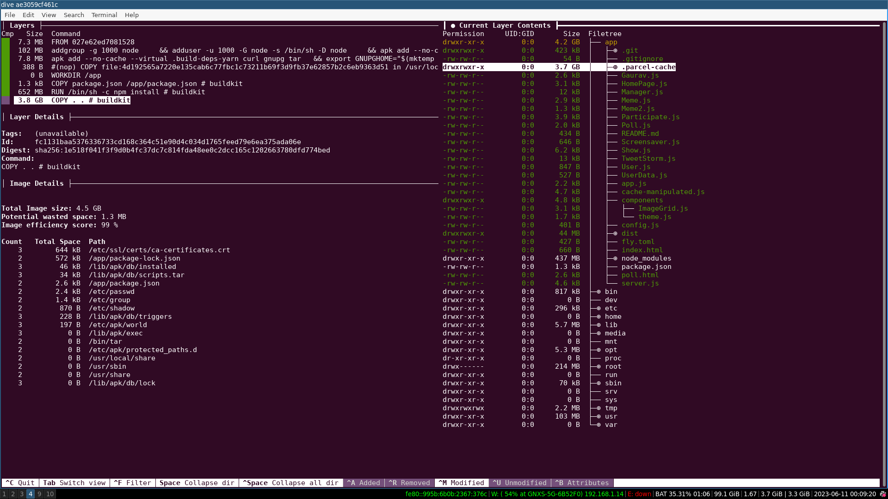

## Profiling Docker Images

As it happens in the middle of a frantic week of prototyping a nodejs app, I installed a bunch of dependencies and was ready to deploy my app to the cloud. At which point I noticed that the docker build step was taking forever.
I ran `docker image ls` and saw that my image was 4 GBs in size. Although I wanted to blame it on the random libraries I had installed, the huge size made me think it was a mistake in my .gitignore file and maybe I was adding some images or something into my docker images.

I was saved by [dive](https://github.com/wagoodman/dive).

Find the ID of the offending docker image.

```shell
docker image ls
```

```shell
dive IMAGE_ID
```

This brings up a tree view of all the files within the various layers of your image.



Thankfully it was a `.parcel-cache` that snuck into the image. Adding it to .dockerignore brought down the image size from 4 GB to 814 MB. This big drop made me write this.

Cherry on top : I realized that there's a `--production` flag for npm install that removes devDependencies. This brought the size down to 358 MB.
