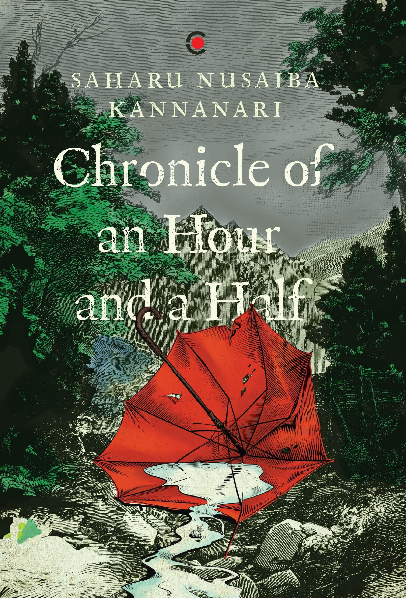

# Decision to Leave

Like [Quarterlife](/reading-notes/quarterlife), this book zooms into a very particular moment in India. In India, in the last decade, some brutal lynchings have happened due to rumors that spread primarily via WhatsApp. This story zooms in on one such fictional incident where traditional prejudices, conservative norms, plain old gossiping and an acceleration facilitated by WhatsApp leads to a very violent lynching of Burhan, a young kid. The story's very specific setting in an unnamed village in Kerala, along with a story that does not really parallel any other lynching from memory, made the story very engrossing. It succeeded in putting me amidst the crazy mob and the sense of scare and helplessness that some of the sane characters in this book feel.