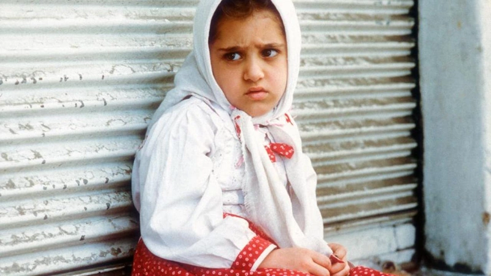

# The White Balloon

A simple story about a young girl who wants to buy a goldfish for the new year. We see the irrational fixation of the girl about the fish. She cajoles her mother and brother to give her money. She gets distracted by shiny things on her way to the market. She loses the money and then eventually manages to find it back with the help of her brother. It captures really well the heavyness of small mishaps and joys that mark your childhood.
